# AgriGuru External Service Integration Guide

## 🌐 Integration Overview

The AgriGuru platform integrates with numerous external services to provide comprehensive agricultural management capabilities. This document details the integration architecture, API specifications, and implementation guidelines for all external service connections.

## 🗺️ Integration Architecture

```mermaid
graph TB
    %% AgriGuru Core Platform
    subgraph "🌾 AgriGuru Platform"
        API_GW[🚪 API Gateway]
        INTEGRATION_LAYER[🔗 Integration Service Layer]
        
        subgraph "🎯 Core Services"
            WEATHER_SVC[🌤️ Weather Service]
            PEST_SVC[🐛 Pest Service]
            MARKET_SVC[💰 Market Service]
            PAYMENT_SVC[💳 Payment Service]
            COMM_SVC[📱 Communication Service]
            GEO_SVC[📍 Geolocation Service]
        end
    end

    %% Weather & Environmental Services
    subgraph "🌤️ Weather & Environment"
        OWM[☁️ OpenWeatherMap]
        ACCUWEATHER[🌦️ AccuWeather]
        WEATHER_API[🌡️ Weather API]
        SATELLITE[🛰️ Satellite Imagery APIs]
    end

    %% AI & Machine Learning Services
    subgraph "🤖 AI & ML Services"
        GROQ[🧠 Groq AI]
        OPENAI[🤖 OpenAI]
        PLANT_ID[🌿 Plant.id API]
        PLANTNET[🍃 PlantNet]
        GOOGLE_VISION[👁️ Google Vision AI]
        CUSTOM_ML[🔬 Custom ML Models]
    end

    %% Payment & Financial Services
    subgraph "💳 Payment & Financial"
        RAZORPAY[💰 Razorpay]
        PAYPAL[🌍 PayPal]
        STRIPE[💳 Stripe]
        PAYTM[📱 Paytm]
        UPI[🏦 UPI Gateway]
        BANKING_API[🏛️ Banking APIs]
    end

    %% Communication Services
    subgraph "📱 Communication"
        TWILIO[📞 Twilio]
        GUPSHUP[💬 Gupshup WhatsApp]
        SENDGRID[📧 SendGrid]
        AWS_SES[📮 AWS SES]
        FCM[🔔 Firebase Cloud Messaging]
        SMS_GATEWAY[📟 SMS Gateway]
    end

    %% Government & Market Data
    subgraph "🏛️ Government & Market APIs"
        AGMARKNET[📈 Agmarknet]
        GOV_SCHEME[📋 Government Schemes API]
        COMMODITY_API[📊 Commodity APIs]
        ENAM[🏪 eNAM Platform]
        PMFBY[🛡️ PM Fasal Bima Yojana]
    end

    %% Location & Mapping Services
    subgraph "🗺️ Maps & Location"
        GOOGLE_MAPS[🗺️ Google Maps]
        MAPBOX[🗺️ Mapbox]
        HERE_MAPS[📍 HERE Maps]
        OPENCAGE[🌍 OpenCage Geocoding]
    end

    %% Cloud Storage & Media
    subgraph "☁️ Cloud Storage"
        AWS_S3[📁 AWS S3]
        CLOUDINARY[📷 Cloudinary]
        GOOGLE_STORAGE[☁️ Google Cloud Storage]
        CDN[🌐 CloudFront CDN]
    end

    %% Connections
    API_GW --> INTEGRATION_LAYER
    
    INTEGRATION_LAYER --> WEATHER_SVC
    INTEGRATION_LAYER --> PEST_SVC
    INTEGRATION_LAYER --> MARKET_SVC
    INTEGRATION_LAYER --> PAYMENT_SVC
    INTEGRATION_LAYER --> COMM_SVC
    INTEGRATION_LAYER --> GEO_SVC
    
    WEATHER_SVC --> OWM
    WEATHER_SVC --> ACCUWEATHER
    WEATHER_SVC --> WEATHER_API
    
    PEST_SVC --> PLANT_ID
    PEST_SVC --> PLANTNET
    PEST_SVC --> GOOGLE_VISION
    PEST_SVC --> GROQ
    
    MARKET_SVC --> AGMARKNET
    MARKET_SVC --> COMMODITY_API
    MARKET_SVC --> ENAM
    
    PAYMENT_SVC --> RAZORPAY
    PAYMENT_SVC --> PAYPAL
    PAYMENT_SVC --> STRIPE
    PAYMENT_SVC --> UPI
    
    COMM_SVC --> TWILIO
    COMM_SVC --> GUPSHUP
    COMM_SVC --> SENDGRID
    COMM_SVC --> FCM
    
    GEO_SVC --> GOOGLE_MAPS
    GEO_SVC --> MAPBOX
    GEO_SVC --> OPENCAGE

    %% Styling
    classDef coreService fill:#e8f5e8,stroke:#1b5e20,stroke-width:2px
    classDef weatherService fill:#e3f2fd,stroke:#1976d2,stroke-width:2px
    classDef aiService fill:#f3e5f5,stroke:#7b1fa2,stroke-width:2px
    classDef paymentService fill:#fff3e0,stroke:#f57c00,stroke-width:2px
    classDef commService fill:#fce4ec,stroke:#c2185b,stroke-width:2px
    classDef govService fill:#e0f2f1,stroke:#00695c,stroke-width:2px
    classDef mapService fill:#fff8e1,stroke:#ff8f00,stroke-width:2px
    classDef storageService fill:#f1f8e9,stroke:#33691e,stroke-width:2px

    class WEATHER_SVC,PEST_SVC,MARKET_SVC coreService
    class OWM,ACCUWEATHER,WEATHER_API weatherService
    class GROQ,PLANT_ID,GOOGLE_VISION aiService
    class RAZORPAY,PAYPAL,STRIPE paymentService
    class TWILIO,GUPSHUP,SENDGRID commService
    class AGMARKNET,GOV_SCHEME,ENAM govService
    class GOOGLE_MAPS,MAPBOX,OPENCAGE mapService
    class AWS_S3,CLOUDINARY,CDN storageService
```



## 🌤️ Weather Service Integrations

### **OpenWeatherMap Integration**

#### **API Configuration**
```python
import requests
from datetime import datetime, timedelta
import asyncio
import aiohttp

class OpenWeatherMapService:
    def __init__(self, api_key):
        self.api_key = api_key
        self.base_url = "https://api.openweathermap.org/data/2.5"
        self.onecall_url = "https://api.openweathermap.org/data/3.0/onecall"
        self.geocoding_url = "https://api.openweathermap.org/geo/1.0"
        
    async def get_current_weather(self, lat, lon, units="metric"):
        """Get current weather conditions"""
        params = {
            "lat": lat,
            "lon": lon,
            "appid": self.api_key,
            "units": units
        }
        
        async with aiohttp.ClientSession() as session:
            async with session.get(f"{self.base_url}/weather", params=params) as response:
                if response.status == 200:
                    data = await response.json()
                    return self.format_current_weather(data)
                else:
                    raise WeatherAPIError(f"API request failed: {response.status}")
    
    async def get_weather_forecast(self, lat, lon, days=7, units="metric"):
        """Get weather forecast"""
        params = {
            "lat": lat,
            "lon": lon,
            "appid": self.api_key,
            "units": units,
            "exclude": "minutely,alerts"
        }
        
        async with aiohttp.ClientSession() as session:
            async with session.get(self.onecall_url, params=params) as response:
                if response.status == 200:
                    data = await response.json()
                    return self.format_forecast_data(data, days)
                else:
                    raise WeatherAPIError(f"Forecast API request failed: {response.status}")
    
    def format_current_weather(self, raw_data):
        """Format current weather data for AgriGuru"""
        return {
            "location": {
                "name": raw_data.get("name"),
                "country": raw_data["sys"].get("country"),
                "coordinates": [raw_data["coord"]["lat"], raw_data["coord"]["lon"]]
            },
            "current": {
                "temperature": raw_data["main"]["temp"],
                "feels_like": raw_data["main"]["feels_like"],
                "humidity": raw_data["main"]["humidity"],
                "pressure": raw_data["main"]["pressure"],
                "visibility": raw_data.get("visibility", 0) / 1000,  # Convert to km
                "uv_index": raw_data.get("uvi", 0),
                "wind_speed": raw_data["wind"]["speed"],
                "wind_direction": raw_data["wind"].get("deg", 0),
                "clouds": raw_data["clouds"]["all"],
                "weather_condition": raw_data["weather"][0]["main"],
                "description": raw_data["weather"][0]["description"]
            },
            "agricultural_metrics": self.calculate_agricultural_metrics(raw_data),
            "timestamp": datetime.utcnow().isoformat()
        }
    
    def calculate_agricultural_metrics(self, weather_data):
        """Calculate agriculture-specific metrics"""
        temp = weather_data["main"]["temp"]
        humidity = weather_data["main"]["humidity"]
        wind_speed = weather_data["wind"]["speed"]
        
        return {
            "irrigation_recommendation": self.get_irrigation_recommendation(temp, humidity),
            "spray_conditions": self.get_spray_conditions(wind_speed, humidity),
            "field_work_suitability": self.get_field_work_suitability(weather_data),
            "disease_risk": self.calculate_disease_risk(temp, humidity),
            "pest_activity_level": self.calculate_pest_activity(temp, humidity)
        }
    
    def get_irrigation_recommendation(self, temperature, humidity):
        """Recommend irrigation based on weather conditions"""
        if temperature > 35 and humidity < 30:
            return {"needed": True, "urgency": "high", "reason": "Hot and dry conditions"}
        elif temperature > 30 and humidity < 50:
            return {"needed": True, "urgency": "medium", "reason": "Warm and moderate humidity"}
        elif humidity > 80:
            return {"needed": False, "urgency": "none", "reason": "High humidity present"}
        else:
            return {"needed": False, "urgency": "low", "reason": "Moderate conditions"}
```

#### **Weather Alert System**
```python
class WeatherAlertService:
    def __init__(self, weather_service, notification_service):
        self.weather_service = weather_service
        self.notification_service = notification_service
        self.alert_thresholds = {
            "temperature": {"min": 5, "max": 45},
            "rainfall": {"heavy": 50, "extreme": 100},
            "wind_speed": {"high": 25, "extreme": 40},
            "humidity": {"low": 20, "high": 90}
        }
    
    async def check_weather_alerts(self, farmer_locations):
        """Check weather conditions and generate alerts"""
        alerts = []
        
        for location in farmer_locations:
            weather_data = await self.weather_service.get_current_weather(
                location["lat"], location["lon"]
            )
            
            location_alerts = self.analyze_weather_conditions(weather_data, location)
            if location_alerts:
                alerts.extend(location_alerts)
        
        # Send alerts to affected farmers
        for alert in alerts:
            await self.send_weather_alert(alert)
        
        return alerts
    
    def analyze_weather_conditions(self, weather_data, location):
        """Analyze weather conditions for potential alerts"""
        alerts = []
        current = weather_data["current"]
        
        # Temperature alerts
        if current["temperature"] < self.alert_thresholds["temperature"]["min"]:
            alerts.append({
                "type": "frost_warning",
                "severity": "high",
                "location": location,
                "message": f"Frost warning: Temperature {current['temperature']}°C",
                "recommendations": [
                    "Cover sensitive crops",
                    "Use frost protection methods",
                    "Harvest ready crops if possible"
                ]
            })
        
        elif current["temperature"] > self.alert_thresholds["temperature"]["max"]:
            alerts.append({
                "type": "heat_wave",
                "severity": "high",
                "location": location,
                "message": f"Heat wave alert: Temperature {current['temperature']}°C",
                "recommendations": [
                    "Increase irrigation frequency",
                    "Provide shade for livestock",
                    "Avoid field work during peak hours"
                ]
            })
        
        # Wind speed alerts
        if current["wind_speed"] > self.alert_thresholds["wind_speed"]["high"]:
            severity = "extreme" if current["wind_speed"] > self.alert_thresholds["wind_speed"]["extreme"] else "high"
            alerts.append({
                "type": "high_wind",
                "severity": severity,
                "location": location,
                "message": f"High wind alert: {current['wind_speed']} km/h",
                "recommendations": [
                    "Secure loose equipment",
                    "Avoid pesticide spraying",
                    "Check greenhouse structures"
                ]
            })
        
        return alerts
```

### **AccuWeather Integration**

```python
class AccuWeatherService:
    def __init__(self, api_key):
        self.api_key = api_key
        self.base_url = "http://dataservice.accuweather.com"
        
    async def get_location_key(self, lat, lon):
        """Get AccuWeather location key for coordinates"""
        params = {
            "apikey": self.api_key,
            "q": f"{lat},{lon}",
            "language": "en"
        }
        
        async with aiohttp.ClientSession() as session:
            async with session.get(
                f"{self.base_url}/locations/v1/cities/geoposition/search",
                params=params
            ) as response:
                if response.status == 200:
                    data = await response.json()
                    return data["Key"]
                else:
                    raise WeatherAPIError("Failed to get location key")
    
    async def get_agricultural_forecast(self, location_key, days=5):
        """Get agricultural-specific forecast"""
        params = {
            "apikey": self.api_key,
            "language": "en",
            "details": "true"
        }
        
        endpoint = f"forecasts/v1/daily/{days}day/{location_key}"
        
        async with aiohttp.ClientSession() as session:
            async with session.get(
                f"{self.base_url}/{endpoint}",
                params=params
            ) as response:
                if response.status == 200:
                    data = await response.json()
                    return self.format_agricultural_forecast(data)
                else:
                    raise WeatherAPIError("Failed to get agricultural forecast")
```

## 🤖 AI & Machine Learning Integrations

### **Groq AI Integration for Agricultural Consultation**

```python
from groq import Groq
import json
import asyncio

class GroqAgriculturalAI:
    def __init__(self, api_key):
        self.client = Groq(api_key=api_key)
        self.model = "llama3-8b-8192"
        self.agricultural_context = self.load_agricultural_context()
        
    def load_agricultural_context(self):
        """Load agricultural knowledge context"""
        return {
            "crops": self.load_crop_database(),
            "pests": self.load_pest_database(),
            "diseases": self.load_disease_database(),
            "fertilizers": self.load_fertilizer_database(),
            "regional_practices": self.load_regional_practices()
        }
    
    async def get_agricultural_advice(self, query, farmer_context=None):
        """Get AI-powered agricultural advice"""
        
        # Prepare system prompt with agricultural expertise
        system_prompt = self.build_agricultural_system_prompt(farmer_context)
        
        # Prepare user query with context
        enhanced_query = self.enhance_query_with_context(query, farmer_context)
        
        try:
            chat_completion = self.client.chat.completions.create(
                messages=[
                    {"role": "system", "content": system_prompt},
                    {"role": "user", "content": enhanced_query}
                ],
                model=self.model,
                temperature=0.3,
                max_tokens=1000
            )
            
            response = chat_completion.choices[0].message.content
            
            # Post-process response for structured output
            structured_response = self.structure_agricultural_response(response, query)
            
            return structured_response
            
        except Exception as e:
            raise AIServiceError(f"Groq AI request failed: {str(e)}")
    
    def build_agricultural_system_prompt(self, farmer_context):
        """Build system prompt with agricultural expertise"""
        base_prompt = """You are an expert agricultural advisor with deep knowledge of:
        - Crop management and cultivation practices
        - Pest and disease identification and treatment
        - Soil health and nutrition management
        - Weather-based farming decisions
        - Organic and sustainable farming methods
        - Regional agricultural practices in India
        
        Provide practical, actionable advice tailored to small and medium-scale farmers.
        Always consider local conditions, seasonal factors, and cost-effectiveness.
        """
        
        if farmer_context:
            context_addition = f"""
            
            Farmer Context:
            - Location: {farmer_context.get('location', 'Not specified')}
            - Farm size: {farmer_context.get('farm_size', 'Not specified')}
            - Primary crops: {farmer_context.get('primary_crops', 'Not specified')}
            - Farming experience: {farmer_context.get('experience', 'Not specified')}
            - Soil type: {farmer_context.get('soil_type', 'Not specified')}
            - Current season: {farmer_context.get('season', 'Not specified')}
            """
            base_prompt += context_addition
        
        return base_prompt
    
    def structure_agricultural_response(self, raw_response, original_query):
        """Structure the AI response for better usability"""
        
        # Analyze query type
        query_type = self.classify_query_type(original_query)
        
        structured = {
            "query_type": query_type,
            "main_advice": raw_response,
            "actionable_steps": self.extract_actionable_steps(raw_response),
            "follow_up_questions": self.generate_follow_up_questions(query_type),
            "related_resources": self.get_related_resources(query_type),
            "confidence_score": self.calculate_confidence_score(raw_response),
            "timestamp": datetime.utcnow().isoformat()
        }
        
        return structured
    
    def classify_query_type(self, query):
        """Classify the type of agricultural query"""
        query_lower = query.lower()
        
        if any(keyword in query_lower for keyword in ["pest", "insect", "bug", "damage"]):
            return "pest_management"
        elif any(keyword in query_lower for keyword in ["disease", "fungus", "bacteria", "virus"]):
            return "disease_management"
        elif any(keyword in query_lower for keyword in ["fertilizer", "nutrition", "soil", "nutrients"]):
            return "soil_nutrition"
        elif any(keyword in query_lower for keyword in ["planting", "sowing", "crop", "variety"]):
            return "crop_management"
        elif any(keyword in query_lower for keyword in ["weather", "rain", "irrigation", "water"]):
            return "weather_irrigation"
        elif any(keyword in query_lower for keyword in ["harvest", "yield", "production"]):
            return "harvest_management"
        else:
            return "general_agriculture"
```

### **Plant Disease Detection with Plant.id API**

```python
import base64
import io
from PIL import Image

class PlantIDService:
    def __init__(self, api_key):
        self.api_key = api_key
        self.base_url = "https://api.plant.id/v3"
        
    async def identify_plant_disease(self, image_data, modifiers=None, plant_details=None):
        """Identify plant diseases from images"""
        
        # Prepare image data
        encoded_image = self.encode_image(image_data)
        
        # Prepare request payload
        payload = {
            "images": [encoded_image],
            "plant_details": ["common_names", "url"],
            "modifiers": modifiers or ["crops_fast", "similar_images"],
            "disease_details": [
                "common_names", 
                "url", 
                "description",
                "treatment",
                "classification",
                "cause"
            ]
        }
        
        if plant_details:
            payload["plant_net_id"] = plant_details.get("plant_net_id")
        
        headers = {
            "Content-Type": "application/json",
            "Api-Key": self.api_key
        }
        
        async with aiohttp.ClientSession() as session:
            async with session.post(
                f"{self.base_url}/identification",
                json=payload,
                headers=headers
            ) as response:
                if response.status == 200:
                    data = await response.json()
                    return self.format_disease_identification(data)
                else:
                    raise PlantIDError(f"Disease identification failed: {response.status}")
    
    def encode_image(self, image_data):
        """Encode image for API submission"""
        if isinstance(image_data, str):
            # If already base64 encoded
            return image_data
        elif isinstance(image_data, bytes):
            # Convert bytes to base64
            return base64.b64encode(image_data).decode('utf-8')
        elif hasattr(image_data, 'read'):
            # If file-like object
            image_bytes = image_data.read()
            return base64.b64encode(image_bytes).decode('utf-8')
        else:
            raise ValueError("Unsupported image data format")
    
    def format_disease_identification(self, raw_data):
        """Format Plant.id response for AgriGuru"""
        if not raw_data.get("is_healthy", True):
            diseases = raw_data.get("health_assessment", {}).get("diseases", [])
            
            formatted_diseases = []
            for disease in diseases:
                formatted_disease = {
                    "name": disease.get("name"),
                    "common_names": disease.get("common_names", []),
                    "confidence": disease.get("probability", 0),
                    "description": disease.get("disease_details", {}).get("description"),
                    "symptoms": disease.get("disease_details", {}).get("symptoms", []),
                    "treatment": self.format_treatment_info(disease.get("disease_details", {})),
                    "cause": disease.get("disease_details", {}).get("cause"),
                    "prevention": disease.get("disease_details", {}).get("prevention", []),
                    "similar_images": disease.get("similar_images", [])
                }
                formatted_diseases.append(formatted_disease)
            
            return {
                "status": "disease_detected",
                "plant_health": "unhealthy",
                "diseases": formatted_diseases,
                "recommendation": self.generate_treatment_recommendation(formatted_diseases),
                "confidence_overall": max([d["confidence"] for d in formatted_diseases]) if formatted_diseases else 0
            }
        else:
            return {
                "status": "healthy",
                "plant_health": "healthy",
                "diseases": [],
                "recommendation": "Plant appears healthy. Continue current care routine.",
                "confidence_overall": raw_data.get("health_assessment", {}).get("is_healthy_probability", 0)
            }
```

## 💳 Payment Gateway Integrations

### **Razorpay Integration for Indian Market**

```python
import razorpay
from decimal import Decimal
import hashlib
import hmac

class RazorpayService:
    def __init__(self, key_id, key_secret):
        self.client = razorpay.Client(auth=(key_id, key_secret))
        self.key_id = key_id
        self.key_secret = key_secret
        
    async def create_order(self, amount, currency="INR", receipt=None, notes=None):
        """Create a Razorpay order"""
        try:
            order_data = {
                "amount": int(amount * 100),  # Convert to paise
                "currency": currency,
                "receipt": receipt or f"agriguru_{int(time.time())}",
                "notes": notes or {}
            }
            
            order = self.client.order.create(data=order_data)
            
            return {
                "order_id": order["id"],
                "amount": amount,
                "currency": currency,
                "status": "created",
                "razorpay_order": order
            }
            
        except Exception as e:
            raise PaymentError(f"Failed to create Razorpay order: {str(e)}")
    
    async def verify_payment_signature(self, payment_id, order_id, signature):
        """Verify Razorpay payment signature"""
        
        # Generate expected signature
        message = f"{order_id}|{payment_id}"
        expected_signature = hmac.new(
            self.key_secret.encode(),
            message.encode(),
            hashlib.sha256
        ).hexdigest()
        
        # Verify signature
        if hmac.compare_digest(expected_signature, signature):
            # Fetch payment details
            payment = self.client.payment.fetch(payment_id)
            
            return {
                "verified": True,
                "payment_status": payment["status"],
                "amount": payment["amount"] / 100,  # Convert back to rupees
                "method": payment["method"],
                "bank": payment.get("bank"),
                "vpa": payment.get("vpa"),
                "created_at": payment["created_at"]
            }
        else:
            return {"verified": False, "error": "Invalid signature"}
    
    async def process_refund(self, payment_id, amount=None, notes=None):
        """Process refund for a payment"""
        try:
            refund_data = {
                "notes": notes or {}
            }
            
            if amount:
                refund_data["amount"] = int(amount * 100)  # Convert to paise
            
            refund = self.client.payment.refund(payment_id, refund_data)
            
            return {
                "refund_id": refund["id"],
                "amount": refund["amount"] / 100,
                "status": refund["status"],
                "created_at": refund["created_at"]
            }
            
        except Exception as e:
            raise PaymentError(f"Failed to process refund: {str(e)}")
    
    async def create_subscription(self, plan_id, customer_id, total_count=None, notes=None):
        """Create a subscription for recurring payments"""
        try:
            subscription_data = {
                "plan_id": plan_id,
                "customer_id": customer_id,
                "total_count": total_count,
                "notes": notes or {}
            }
            
            subscription = self.client.subscription.create(subscription_data)
            
            return {
                "subscription_id": subscription["id"],
                "status": subscription["status"],
                "plan_id": plan_id,
                "customer_id": customer_id,
                "created_at": subscription["created_at"]
            }
            
        except Exception as e:
            raise PaymentError(f"Failed to create subscription: {str(e)}")
```

### **UPI Payment Integration**

```python
class UPIPaymentService:
    def __init__(self, merchant_id, merchant_key):
        self.merchant_id = merchant_id
        self.merchant_key = merchant_key
        self.base_url = "https://api.upi.payment.gateway.com"
        
    def generate_upi_payment_url(self, amount, transaction_id, customer_name, description):
        """Generate UPI payment URL"""
        
        upi_params = {
            "pa": f"{self.merchant_id}@paytm",  # Payee address
            "pn": "AgriGuru",  # Payee name
            "tr": transaction_id,  # Transaction reference
            "tn": description,  # Transaction note
            "am": str(amount),  # Amount
            "cu": "INR",  # Currency
            "mc": "5411"  # Merchant category code (Agriculture)
        }
        
        # Generate UPI URL
        upi_url = "upi://pay?" + "&".join([f"{k}={v}" for k, v in upi_params.items()])
        
        return {
            "upi_url": upi_url,
            "qr_code_data": upi_url,
            "transaction_id": transaction_id,
            "amount": amount,
            "expires_at": datetime.utcnow() + timedelta(minutes=15)
        }
    
    async def verify_upi_transaction(self, transaction_id):
        """Verify UPI transaction status"""
        
        payload = {
            "merchant_id": self.merchant_id,
            "transaction_id": transaction_id,
            "checksum": self.generate_checksum(transaction_id)
        }
        
        async with aiohttp.ClientSession() as session:
            async with session.post(
                f"{self.base_url}/verify",
                json=payload
            ) as response:
                if response.status == 200:
                    data = await response.json()
                    return {
                        "transaction_id": transaction_id,
                        "status": data["status"],
                        "amount": data["amount"],
                        "utr": data.get("utr"),  # UPI transaction reference
                        "bank_ref": data.get("bank_ref"),
                        "verified_at": datetime.utcnow()
                    }
                else:
                    raise PaymentError("UPI verification failed")
```

## 📱 Communication Service Integrations

### **WhatsApp Business API Integration**

```python
import requests
from urllib.parse import quote

class WhatsAppBusinessService:
    def __init__(self, access_token, phone_number_id):
        self.access_token = access_token
        self.phone_number_id = phone_number_id
        self.base_url = "https://graph.facebook.com/v18.0"
        
    async def send_text_message(self, recipient_phone, message_text):
        """Send text message via WhatsApp Business API"""
        
        payload = {
            "messaging_product": "whatsapp",
            "to": recipient_phone,
            "type": "text",
            "text": {
                "body": message_text
            }
        }
        
        headers = {
            "Authorization": f"Bearer {self.access_token}",
            "Content-Type": "application/json"
        }
        
        async with aiohttp.ClientSession() as session:
            async with session.post(
                f"{self.base_url}/{self.phone_number_id}/messages",
                json=payload,
                headers=headers
            ) as response:
                if response.status == 200:
                    data = await response.json()
                    return {
                        "message_id": data["messages"][0]["id"],
                        "status": "sent",
                        "recipient": recipient_phone
                    }
                else:
                    raise CommunicationError("Failed to send WhatsApp message")
    
    async def send_template_message(self, recipient_phone, template_name, template_params=None):
        """Send template message via WhatsApp Business API"""
        
        payload = {
            "messaging_product": "whatsapp",
            "to": recipient_phone,
            "type": "template",
            "template": {
                "name": template_name,
                "language": {
                    "code": "en"
                }
            }
        }
        
        if template_params:
            payload["template"]["components"] = [
                {
                    "type": "body",
                    "parameters": [
                        {"type": "text", "text": param} for param in template_params
                    ]
                }
            ]
        
        headers = {
            "Authorization": f"Bearer {self.access_token}",
            "Content-Type": "application/json"
        }
        
        async with aiohttp.ClientSession() as session:
            async with session.post(
                f"{self.base_url}/{self.phone_number_id}/messages",
                json=payload,
                headers=headers
            ) as response:
                if response.status == 200:
                    data = await response.json()
                    return {
                        "message_id": data["messages"][0]["id"],
                        "status": "sent",
                        "template": template_name,
                        "recipient": recipient_phone
                    }
                else:
                    raise CommunicationError("Failed to send WhatsApp template")
    
    async def send_weather_alert(self, recipient_phone, weather_data, farmer_name):
        """Send weather alert via WhatsApp"""
        
        alert_message = f"""🌤️ *Weather Alert for {farmer_name}*

📍 Location: {weather_data['location']['name']}
🌡️ Temperature: {weather_data['current']['temperature']}°C
💧 Humidity: {weather_data['current']['humidity']}%
💨 Wind: {weather_data['current']['wind_speed']} km/h

⚠️ *Agricultural Recommendations:*
{weather_data['agricultural_metrics']['irrigation_recommendation']['reason']}

Stay safe and plan your farming activities accordingly!

- AgriGuru Team"""
        
        return await self.send_text_message(recipient_phone, alert_message)
```

### **SMS Integration with Multiple Providers**

```python
class SMSService:
    def __init__(self):
        self.providers = {
            "twilio": TwilioSMSProvider(),
            "textlocal": TextLocalProvider(),
            "msg91": MSG91Provider()
        }
        self.primary_provider = "twilio"
        self.fallback_providers = ["textlocal", "msg91"]
    
    async def send_sms(self, phone_number, message, priority="normal"):
        """Send SMS with failover support"""
        
        # Try primary provider first
        try:
            result = await self.providers[self.primary_provider].send_sms(
                phone_number, message
            )
            
            if result["status"] == "sent":
                return result
                
        except Exception as e:
            logging.warning(f"Primary SMS provider failed: {str(e)}")
        
        # Try fallback providers
        for provider_name in self.fallback_providers:
            try:
                result = await self.providers[provider_name].send_sms(
                    phone_number, message
                )
                
                if result["status"] == "sent":
                    logging.info(f"SMS sent via fallback provider: {provider_name}")
                    return result
                    
            except Exception as e:
                logging.warning(f"Fallback SMS provider {provider_name} failed: {str(e)}")
        
        # All providers failed
        raise CommunicationError("Failed to send SMS via all providers")

class TwilioSMSProvider:
    def __init__(self):
        self.client = Client(settings.TWILIO_ACCOUNT_SID, settings.TWILIO_AUTH_TOKEN)
        self.from_number = settings.TWILIO_PHONE_NUMBER
    
    async def send_sms(self, to_number, message):
        """Send SMS via Twilio"""
        try:
            message = self.client.messages.create(
                body=message,
                from_=self.from_number,
                to=to_number
            )
            
            return {
                "status": "sent",
                "message_id": message.sid,
                "provider": "twilio",
                "cost": message.price
            }
            
        except Exception as e:
            raise CommunicationError(f"Twilio SMS failed: {str(e)}")
```

## 🏛️ Government API Integrations

### **Agmarknet Price Data Integration**

```python
class AgmarknetService:
    def __init__(self):
        self.base_url = "https://api.data.gov.in/resource"
        self.api_key = settings.AGMARKNET_API_KEY
        
    async def get_commodity_prices(self, state=None, district=None, market=None, commodity=None):
        """Get commodity prices from Agmarknet"""
        
        params = {
            "api-key": self.api_key,
            "format": "json",
            "limit": 1000
        }
        
        # Add filters
        filters = []
        if state:
            filters.append(f"state:{state}")
        if district:
            filters.append(f"district:{district}")
        if market:
            filters.append(f"market:{market}")
        if commodity:
            filters.append(f"commodity:{commodity}")
        
        if filters:
            params["filters"] = ",".join(filters)
        
        resource_id = "9ef84268-d588-465a-a308-a864a43d0070"  # Agmarknet resource ID
        
        async with aiohttp.ClientSession() as session:
            async with session.get(
                f"{self.base_url}/{resource_id}",
                params=params
            ) as response:
                if response.status == 200:
                    data = await response.json()
                    return self.format_price_data(data)
                else:
                    raise GovernmentAPIError("Failed to fetch Agmarknet data")
    
    def format_price_data(self, raw_data):
        """Format Agmarknet price data for AgriGuru"""
        
        formatted_prices = []
        
        for record in raw_data.get("records", []):
            price_record = {
                "commodity": record.get("commodity"),
                "variety": record.get("variety"),
                "market": record.get("market"),
                "district": record.get("district"),
                "state": record.get("state"),
                "arrival_date": record.get("arrival_date"),
                "min_price": float(record.get("min_price", 0)),
                "max_price": float(record.get("max_price", 0)),
                "modal_price": float(record.get("modal_price", 0)),
                "unit": "quintal",
                "currency": "INR",
                "source": "agmarknet",
                "last_updated": datetime.utcnow().isoformat()
            }
            
            # Calculate price trend
            price_record["trend"] = self.calculate_price_trend(price_record)
            
            formatted_prices.append(price_record)
        
        return {
            "prices": formatted_prices,
            "total_records": len(formatted_prices),
            "data_source": "Government of India - Agmarknet",
            "last_updated": datetime.utcnow().isoformat()
        }
```

## 🔄 Integration Management & Monitoring

### **Integration Health Monitoring**

```python
class IntegrationHealthMonitor:
    def __init__(self):
        self.services = {
            "weather": ["openweathermap", "accuweather"],
            "ai": ["groq", "plant_id", "plantnet"],
            "payment": ["razorpay", "paypal", "stripe"],
            "communication": ["whatsapp", "twilio", "sendgrid"],
            "government": ["agmarknet", "government_schemes"]
        }
        
    async def monitor_all_integrations(self):
        """Monitor health of all external integrations"""
        
        health_status = {}
        
        for category, services in self.services.items():
            health_status[category] = {}
            
            for service in services:
                try:
                    status = await self.check_service_health(service)
                    health_status[category][service] = status
                except Exception as e:
                    health_status[category][service] = {
                        "status": "error",
                        "error": str(e),
                        "last_checked": datetime.utcnow().isoformat()
                    }
        
        # Store health status
        await self.store_health_status(health_status)
        
        # Alert on failures
        await self.alert_on_failures(health_status)
        
        return health_status
    
    async def check_service_health(self, service_name):
        """Check health of a specific service"""
        
        health_checks = {
            "openweathermap": self.check_openweather_health,
            "groq": self.check_groq_health,
            "razorpay": self.check_razorpay_health,
            "whatsapp": self.check_whatsapp_health,
            "agmarknet": self.check_agmarknet_health
        }
        
        if service_name in health_checks:
            return await health_checks[service_name]()
        else:
            return {"status": "unknown", "message": "Health check not implemented"}
    
    async def check_openweather_health(self):
        """Check OpenWeatherMap API health"""
        try:
            # Simple API call to check connectivity
            weather_service = OpenWeatherMapService(settings.OPENWEATHER_API_KEY)
            await weather_service.get_current_weather(28.6139, 77.2090)  # Delhi coordinates
            
            return {
                "status": "healthy",
                "response_time": "< 1s",
                "last_checked": datetime.utcnow().isoformat()
            }
        except Exception as e:
            return {
                "status": "unhealthy",
                "error": str(e),
                "last_checked": datetime.utcnow().isoformat()
            }
```

This comprehensive integration guide provides the foundation for connecting AgriGuru with all necessary external services, ensuring reliable and scalable agricultural management capabilities.