# AgriGuru System Architecture

## 🏗️ Complete System Architecture Diagram

```mermaid
graph TB
    %% User Layer
    subgraph "👥 User Layer"
        U1[👨‍🌾 Farmers]
        U2[👨‍🔬 Agricultural Experts]
        U3[🏪 Suppliers/Vendors]
        U4[🛒 Buyers]
        U5[🏛️ Government Officials]
        U6[⚙️ System Administrators]
    end

    %% Access Control Layer
    subgraph "🔐 Access Control"
        AC1[🔓 Public Access]
        AC2[🔒 Standard Access]
        AC3[🔑 Professional Access]
        AC4[👑 Full Access]
    end

    %% Client Applications
    subgraph "📱 Client Applications"
        CA1[🌐 Web Application<br/>React.js]
        CA2[📱 Mobile App<br/>Android/iOS]
        CA3[📟 WhatsApp Bot]
        CA4[📧 Email Client]
    end

    %% API Gateway & Security
    subgraph "🚪 API Gateway & Security"
        AG[🚪 API Gateway<br/>Rate Limiting, Routing]
        AUTH[🔐 Authentication Service<br/>JWT, OAuth 2.0]
        AUTHZ[🛡️ Authorization Service<br/>RBAC, Permissions]
    end

    %% Core Microservices
    subgraph "🎯 Core Microservices"
        %% User Management
        subgraph "👤 User Management"
            UM[👥 User Service]
            PROF[📋 Profile Service]
            ROLE[🎭 Role Management]
        end

        %% Agricultural Services
        subgraph "🌾 Agricultural Services"
            CROP[🌱 Crop Management Service]
            PEST[🐛 Pest & Disease Service]
            SOIL[🌍 Soil Analysis Service]
            FERT[🧪 Fertilizer Service]
        end

        %% Advisory Services
        subgraph "💡 Advisory Services"
            AI[🤖 AI Expert Service]
            CONS[👨‍🔬 Consultation Service]
            TRAIN[📚 Training Service]
        end

        %% Market Services
        subgraph "💰 Market Services"
            PRICE[📈 Price Tracking Service]
            TRADE[🤝 Trading Service]
            SUP[🏪 Supply Chain Service]
        end

        %% Support Services
        subgraph "🔧 Support Services"
            EQUIP[🚜 Equipment Service]
            FIN[💳 Financial Service]
            GOV[🏛️ Government Schemes]
            QUAL[✅ Quality Assessment]
        end
    end

    %% Analytics & Monitoring
    subgraph "📊 Analytics & Intelligence"
        ANAL[📊 Analytics Engine]
        DASH[📈 Dashboard Service]
        REP[📋 Reporting Service]
        ML[🧠 ML/AI Engine]
    end

    %% Communication Services
    subgraph "📢 Communication Services"
        NOT[🔔 Notification Service]
        MSG[💬 Messaging Service]
        ALERT[⚠️ Alert Service]
        NEWS[📰 News Service]
    end

    %% External Integrations
    subgraph "🌐 External Services"
        %% Weather & Location
        subgraph "🌤️ Weather & Location"
            WAPI[☁️ OpenWeatherMap]
            GMAP[🗺️ Google Maps]
            GPS[📍 GPS Services]
        end

        %% AI & Recognition
        subgraph "🤖 AI & Recognition"
            GROQ[🧠 Groq AI]
            IMG[📷 Image Recognition]
            PLANT[🌿 PlantNet API]
        end

        %% Financial Services
        subgraph "💳 Payment & Banking"
            PAY1[💳 Razorpay]
            PAY2[💰 PayPal]
            PAY3[🏦 Stripe]
            BANK[🏛️ Banking APIs]
        end

        %% Communication
        subgraph "📱 Communication"
            WA[📱 WhatsApp API]
            SMS[📟 SMS Services]
            EMAIL[📧 Email Services]
        end

        %% Government & Data
        subgraph "🏛️ Gov & Data APIs"
            GOVAPI[🏛️ Agmarknet API]
            NEWSAPI[📰 News API]
            SCHEME[📋 Scheme APIs]
        end
    end

    %% Data Layer
    subgraph "🗄️ Data Layer"
        %% Primary Databases
        subgraph "📊 Primary Storage"
            DB1[(🗄️ User Database<br/>PostgreSQL)]
            DB2[(🌾 Agricultural Database<br/>PostgreSQL)]
            DB3[(📈 Analytics Database<br/>ClickHouse)]
        end

        %% Cache & Search
        subgraph "⚡ Cache & Search"
            REDIS[⚡ Redis Cache]
            ELASTIC[🔍 Elasticsearch]
        end

        %% File Storage
        subgraph "📁 File Storage"
            S3[☁️ AWS S3<br/>Images, Documents]
            CDN[🌐 CloudFront CDN]
        end

        %% Message Queue
        subgraph "📨 Message Queue"
            QUEUE[📨 RabbitMQ/Kafka]
        end
    end

    %% Infrastructure Layer
    subgraph "☁️ Infrastructure"
        %% Deployment
        subgraph "🚀 Deployment"
            K8S[⚓ Kubernetes]
            DOCKER[🐳 Docker Containers]
        end

        %% Monitoring
        subgraph "📊 Monitoring"
            PROM[📊 Prometheus]
            GRAF[📈 Grafana]
            LOG[📝 ELK Stack]
        end

        %% CI/CD
        subgraph "🔄 CI/CD"
            GIT[📁 GitHub Actions]
            DEPLOY[🚀 Automated Deployment]
        end
    end

    %% Connections - User to Access Control
    U1 -.-> AC2
    U2 -.-> AC3
    U3 -.-> AC3
    U4 -.-> AC2
    U5 -.-> AC2
    U6 -.-> AC4

    %% Connections - Access Control to Clients
    AC1 --> CA1
    AC2 --> CA1
    AC3 --> CA1
    AC4 --> CA1
    AC2 --> CA2
    AC3 --> CA2

    %% Connections - Clients to API Gateway
    CA1 --> AG
    CA2 --> AG
    CA3 --> AG

    %% Connections - API Gateway to Security
    AG --> AUTH
    AG --> AUTHZ

    %% Connections - Security to Services
    AUTH --> UM
    AUTHZ --> UM
    AUTH --> CROP
    AUTH --> PEST
    AUTH --> AI
    AUTH --> PRICE

    %% Connections - Services to Analytics
    CROP --> ANAL
    PEST --> ANAL
    PRICE --> ANAL
    AI --> ANAL

    %% Connections - Services to Communication
    CROP --> NOT
    PEST --> ALERT
    PRICE --> NOT
    GOV --> NEWS

    %% Connections - Services to External APIs
    PEST --> IMG
    PEST --> PLANT
    CROP --> WAPI
    CROP --> GMAP
    AI --> GROQ
    PRICE --> GOVAPI
    FIN --> PAY1
    FIN --> PAY2
    FIN --> PAY3
    NOT --> WA
    NOT --> SMS
    NOT --> EMAIL

    %% Connections - Services to Data Layer
    UM --> DB1
    CROP --> DB2
    PEST --> DB2
    PRICE --> DB2
    ANAL --> DB3
    CROP --> S3
    PEST --> S3
    NOT --> QUEUE
    ALERT --> QUEUE
    
    %% Cache connections
    UM --> REDIS
    PRICE --> REDIS
    CROP --> REDIS

    %% Search connections
    CROP --> ELASTIC
    NEWS --> ELASTIC

    %% Styling
    classDef userClass fill:#e1f5fe,stroke:#01579b,stroke-width:2px
    classDef accessClass fill:#f3e5f5,stroke:#4a148c,stroke-width:2px
    classDef clientClass fill:#e8f5e8,stroke:#1b5e20,stroke-width:2px
    classDef serviceClass fill:#fff3e0,stroke:#e65100,stroke-width:2px
    classDef dataClass fill:#fce4ec,stroke:#880e4f,stroke-width:2px
    classDef extClass fill:#f1f8e9,stroke:#33691e,stroke-width:2px
    classDef infraClass fill:#f5f5f5,stroke:#424242,stroke-width:2px

    class U1,U2,U3,U4,U5,U6 userClass
    class AC1,AC2,AC3,AC4 accessClass
    class CA1,CA2,CA3,CA4 clientClass
    class UM,CROP,PEST,AI,PRICE,NOT serviceClass
    class DB1,DB2,DB3,REDIS dataClass
    class WAPI,GROQ,PAY1,WA extClass
    class K8S,DOCKER,PROM infraClass
```

## 🎯 Architecture Overview

### **Client Layer**
- **Web Application**: React.js based responsive web interface
- **Mobile Applications**: Native Android/iOS apps
- **WhatsApp Bot**: Conversational interface for farmers
- **Email Integration**: Automated notifications and reports

### **API Gateway & Security**
- **API Gateway**: Centralized entry point with rate limiting, routing, and load balancing
- **Authentication**: JWT-based authentication with OAuth 2.0 support
- **Authorization**: Role-based access control (RBAC) with fine-grained permissions

### **Microservices Architecture**
The system follows a microservices pattern with domain-driven design:

#### **User Management Services**
- **User Service**: Registration, profile management, authentication
- **Profile Service**: Farmer profiles, expert credentials, business details
- **Role Management**: Dynamic role assignment and permission management

#### **Agricultural Services**
- **Crop Management**: Crop planning, monitoring, harvest tracking
- **Pest & Disease Service**: AI-powered identification and treatment recommendations
- **Soil Analysis**: Soil health monitoring and fertilizer recommendations
- **Fertilizer Service**: Organic and chemical fertilizer guidance

#### **Advisory Services**
- **AI Expert Service**: 24/7 agricultural consultation using Groq AI
- **Consultation Service**: Connect farmers with human experts
- **Training Service**: Educational content and certification programs

#### **Market Services**
- **Price Tracking**: Real-time commodity prices and market trends
- **Trading Service**: B2B marketplace for agricultural products
- **Supply Chain**: End-to-end supply chain management

#### **Support Services**
- **Equipment Service**: Rental and purchase of farming equipment
- **Financial Service**: Loans, insurance, and payment processing
- **Government Schemes**: Access to subsidies and government programs
- **Quality Assessment**: Crop quality evaluation and certification

### **Data Architecture**
- **PostgreSQL**: Primary relational database for structured data
- **ClickHouse**: Analytics database for time-series and aggregated data
- **Redis**: Caching layer for session management and frequently accessed data
- **Elasticsearch**: Full-text search for crops, experts, and content
- **AWS S3**: Object storage for images, documents, and media files
- **Message Queue**: Asynchronous processing using RabbitMQ/Kafka

### **External Integrations**
- **Weather Services**: OpenWeatherMap, AccuWeather for localized weather data
- **AI Services**: Groq AI for natural language processing and expert advice
- **Image Recognition**: Plant identification and disease detection APIs
- **Payment Gateways**: Razorpay, PayPal, Stripe for secure transactions
- **Communication**: WhatsApp Business API, SMS services, email providers
- **Government APIs**: Agmarknet for market prices, scheme databases

### **Infrastructure**
- **Containerization**: Docker containers for all services
- **Orchestration**: Kubernetes for container management and scaling
- **Monitoring**: Prometheus metrics, Grafana dashboards, ELK stack for logs
- **CI/CD**: GitHub Actions for automated testing and deployment

## 🔒 Security Architecture

### **Authentication Flow**
1. User login through web/mobile client
2. API Gateway routes to Authentication Service
3. JWT token issued upon successful authentication
4. Token validation for subsequent requests
5. Role-based authorization enforcement

### **Data Protection**
- End-to-end encryption for sensitive data
- PII data encryption at rest
- API rate limiting and DDoS protection
- Regular security audits and penetration testing
- GDPR and data privacy compliance

### **Access Control Levels**
- **Public Access**: Weather data, basic crop information
- **Standard Access**: Farmers, buyers with basic features
- **Professional Access**: Experts, suppliers with advanced features
- **Full Access**: System administrators with complete control

## 📈 Scalability & Performance

### **Horizontal Scaling**
- Microservices can scale independently based on demand
- Load balancers distribute traffic across service instances
- Database read replicas for improved performance
- CDN for global content delivery

### **Performance Optimization**
- Redis caching for frequently accessed data
- Database indexing and query optimization
- Asynchronous processing for heavy operations
- API response compression and pagination

### **Monitoring & Alerting**
- Real-time performance monitoring
- Automated alerting for system issues
- Health checks for all services
- Business metrics and KPI tracking