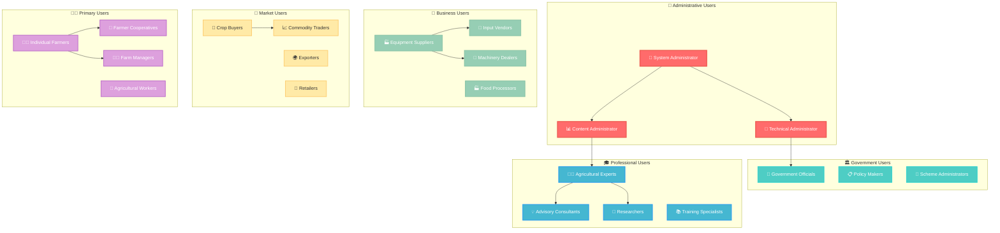
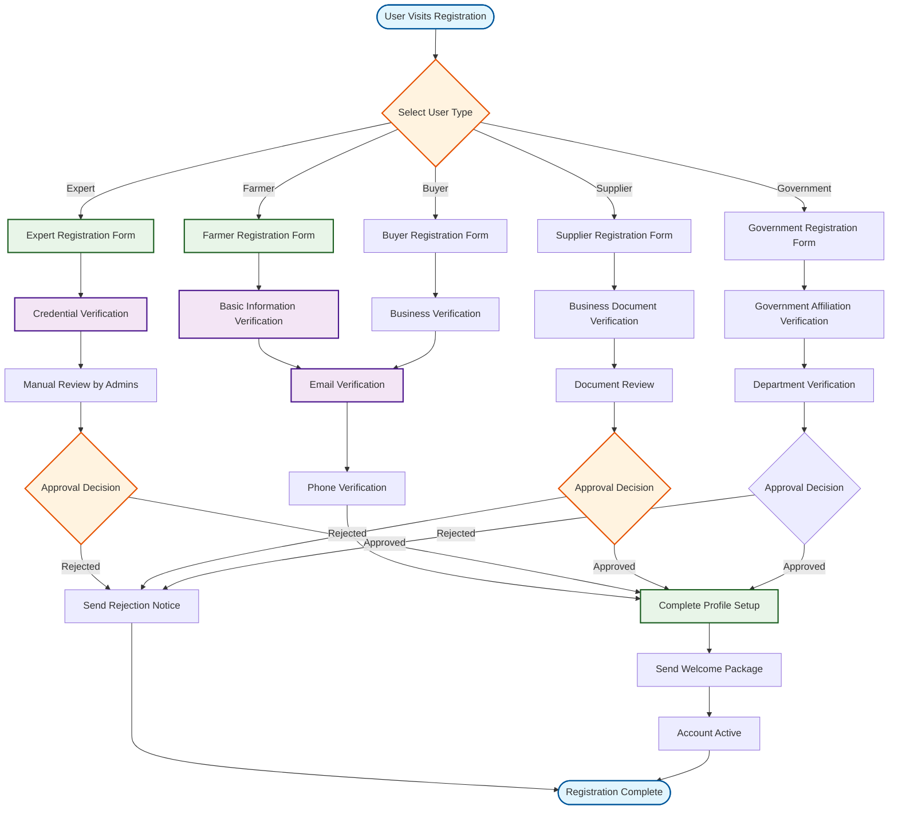

# AgriGuru User Management Architecture

## 👥 User Management Overview

The AgriGuru platform implements a comprehensive **role-based user management system** designed to serve diverse stakeholders in the agricultural ecosystem. This document details the user types, access control mechanisms, and management workflows.

## 🎭 User Role Hierarchy



## 🔐 Access Control Matrix

### **Permission Levels**

| Permission Level | Description | User Types | Access Scope |
|-----------------|-------------|------------|--------------|
| **Level 5 - Full Access** | Complete system control | System Administrators | All resources, configurations, user management |
| **Level 4 - Administrative** | Platform management | Technical/Content Admins | User management, content control, system monitoring |
| **Level 3 - Professional** | Expert capabilities | Experts, Advisors, Suppliers | Consultation tools, knowledge management, business features |
| **Level 2 - Standard** | Regular user access | Farmers, Buyers | Core agricultural features, marketplace access |
| **Level 1 - Limited** | Read-only access | Government Officials, Visitors | Analytics, reports, public information |

### **Detailed Permission Matrix**

```python
PERMISSION_MATRIX = {
    "system_administrator": {
        "user_management": ["create", "read", "update", "delete", "suspend", "activate"],
        "system_configuration": ["read", "update", "backup", "restore"],
        "security_management": ["read", "update", "audit"],
        "content_management": ["create", "read", "update", "delete", "moderate"],
        "analytics": ["read", "export", "configure"],
        "financial_data": ["read", "update", "process"],
        "all_user_data": ["read", "update", "delete", "export"]
    },
    
    "agricultural_expert": {
        "own_profile": ["read", "update"],
        "consultations": ["create", "read", "update"],
        "knowledge_base": ["create", "read", "update", "publish"],
        "farmer_data": ["read"],  # Limited, consultation-related only
        "training_content": ["create", "read", "update", "publish"],
        "expert_directory": ["read"],
        "analytics": ["read"],  # Own performance analytics
        "communication": ["send", "receive"]
    },
    
    "farmer": {
        "own_profile": ["read", "update"],
        "own_farm_data": ["create", "read", "update", "delete"],
        "crop_management": ["create", "read", "update"],
        "consultations": ["request", "participate", "rate"],
        "marketplace": ["browse", "buy", "sell"],
        "equipment_rental": ["browse", "rent", "review"],
        "weather_data": ["read"],
        "market_prices": ["read", "subscribe"],
        "government_schemes": ["read", "apply"],
        "training_content": ["read", "enroll"],
        "community": ["participate", "share"]
    },
    
    "supplier": {
        "own_profile": ["read", "update"],
        "product_catalog": ["create", "read", "update", "delete"],
        "inventory_management": ["create", "read", "update"],
        "order_management": ["read", "update", "fulfill"],
        "customer_communication": ["send", "receive"],
        "payment_processing": ["process", "track"],
        "analytics": ["read"],  # Sales and performance analytics
        "marketplace": ["list", "sell", "promote"]
    },
    
    "government_official": {
        "own_profile": ["read", "update"],
        "aggregated_analytics": ["read", "export"],
        "scheme_management": ["create", "read", "update"],
        "policy_announcements": ["create", "publish"],
        "regional_reports": ["read", "generate"],
        "compliance_monitoring": ["read"],
        "farmer_welfare_data": ["read"],  # Anonymized
        "market_intelligence": ["read"]
    },
    
    "buyer": {
        "own_profile": ["read", "update"],
        "crop_procurement": ["browse", "bid", "purchase"],
        "quality_assessment": ["request", "participate"],
        "supply_chain": ["track", "manage"],
        "payment_processing": ["process"],
        "contract_farming": ["create", "manage"],
        "market_analytics": ["read"],
        "supplier_communication": ["send", "receive"]
    }
}
```

## 👨‍🌾 User Types & Profiles

### **1. Farmers (Primary Users)**

#### **Individual Farmers**
```python
class FarmerProfile:
    def __init__(self):
        self.user_type = "farmer"
        self.farm_details = {
            "total_area": None,  # in acres/hectares
            "land_ownership": None,  # owned/leased/shared
            "soil_types": [],
            "water_sources": [],
            "primary_crops": [],
            "farming_methods": [],  # organic/conventional/integrated
            "machinery_owned": [],
            "livestock": {}
        }
        self.economic_profile = {
            "annual_income_range": None,
            "loan_history": [],
            "insurance_policies": [],
            "government_benefits": []
        }
        self.preferences = {
            "language": "en",
            "communication_channels": ["app", "sms"],
            "notification_timing": "morning",
            "expertise_areas_of_interest": []
        }

# Registration workflow
def register_farmer(registration_data):
    # Basic validation
    validate_farmer_data(registration_data)
    
    # Create user account
    user = create_user_account(registration_data, user_type="farmer")
    
    # Create farmer profile
    farmer_profile = FarmerProfile()
    farmer_profile.update_from_registration(registration_data)
    
    # Setup farm fields
    if registration_data.get("farm_fields"):
        create_farm_fields(user.id, registration_data["farm_fields"])
    
    # Initialize preferences
    setup_default_preferences(user.id)
    
    # Send welcome package
    send_farmer_welcome_package(user)
    
    return user
```

#### **Farmer Cooperatives**
```python
class CooperativeProfile:
    def __init__(self):
        self.user_type = "cooperative"
        self.organization_details = {
            "cooperative_name": None,
            "registration_number": None,
            "member_count": None,
            "total_farm_area": None,
            "established_year": None,
            "legal_status": None
        }
        self.member_management = {
            "member_farmers": [],
            "leadership_structure": {},
            "decision_making_process": None
        }
        self.collective_resources = {
            "shared_equipment": [],
            "storage_facilities": [],
            "processing_units": [],
            "marketing_channels": []
        }
```

### **2. Agricultural Experts & Advisors**

#### **Expert Verification Process**
```python
class ExpertVerificationService:
    def __init__(self):
        self.verification_criteria = {
            "education": ["degree_verification", "institution_check"],
            "experience": ["employment_history", "project_portfolio"],
            "certifications": ["professional_licenses", "continuing_education"],
            "reputation": ["peer_reviews", "publication_record"]
        }
    
    def verify_expert(self, expert_id, verification_documents):
        verification_result = {
            "status": "pending",
            "verified_aspects": [],
            "pending_verification": [],
            "rejection_reasons": []
        }
        
        # Document verification
        for criterion, checks in self.verification_criteria.items():
            if criterion in verification_documents:
                verification_status = self.verify_criterion(
                    criterion, 
                    verification_documents[criterion]
                )
                
                if verification_status["verified"]:
                    verification_result["verified_aspects"].append(criterion)
                else:
                    verification_result["pending_verification"].append(criterion)
                    verification_result["rejection_reasons"].extend(
                        verification_status["issues"]
                    )
        
        # Overall verification decision
        if len(verification_result["verified_aspects"]) >= 3:
            verification_result["status"] = "verified"
            self.grant_expert_privileges(expert_id)
        elif len(verification_result["rejection_reasons"]) > 2:
            verification_result["status"] = "rejected"
        
        return verification_result
    
    def grant_expert_privileges(self, expert_id):
        # Add expert role
        add_user_role(expert_id, "agricultural_expert")
        
        # Setup expert dashboard
        setup_expert_dashboard(expert_id)
        
        # Enable consultation features
        enable_consultation_capabilities(expert_id)
        
        # Add to expert directory
        add_to_expert_directory(expert_id)
```

#### **Expert Specialization Framework**
```python
EXPERT_SPECIALIZATIONS = {
    "crop_management": {
        "subcategories": [
            "cereal_crops", "pulse_crops", "oilseed_crops", 
            "cash_crops", "horticulture", "organic_farming"
        ],
        "expertise_levels": ["basic", "intermediate", "advanced", "specialist"]
    },
    "pest_and_disease": {
        "subcategories": [
            "entomology", "plant_pathology", "weed_management",
            "integrated_pest_management", "biological_control"
        ]
    },
    "soil_and_nutrition": {
        "subcategories": [
            "soil_science", "nutrient_management", "fertilizer_application",
            "soil_health", "precision_agriculture"
        ]
    },
    "water_management": {
        "subcategories": [
            "irrigation_systems", "water_conservation", "drainage",
            "rainwater_harvesting", "precision_irrigation"
        ]
    },
    "agricultural_engineering": {
        "subcategories": [
            "farm_mechanization", "post_harvest_technology",
            "renewable_energy", "automation", "precision_equipment"
        ]
    },
    "livestock": {
        "subcategories": [
            "dairy_farming", "poultry", "goat_farming",
            "animal_nutrition", "veterinary_care"
        ]
    }
}
```

### **3. Suppliers & Vendors**

#### **Supplier Onboarding Process**
```python
class SupplierOnboardingService:
    def __init__(self):
        self.required_documents = [
            "business_registration",
            "tax_registration",
            "quality_certifications",
            "insurance_documents",
            "bank_account_details"
        ]
    
    def onboard_supplier(self, supplier_data):
        # Business verification
        business_verification = self.verify_business_documents(
            supplier_data["documents"]
        )
        
        if not business_verification["verified"]:
            return {
                "status": "rejected",
                "reasons": business_verification["issues"]
            }
        
        # Create supplier profile
        supplier = create_supplier_profile(supplier_data)
        
        # Setup product catalog
        if supplier_data.get("initial_products"):
            setup_product_catalog(supplier.id, supplier_data["initial_products"])
        
        # Configure payment processing
        setup_payment_processing(supplier.id, supplier_data["payment_info"])
        
        # Setup logistics
        configure_logistics_settings(supplier.id, supplier_data["logistics"])
        
        # Assign business developer
        assign_business_developer(supplier.id)
        
        return {
            "status": "approved",
            "supplier_id": supplier.id,
            "next_steps": [
                "Complete product catalog setup",
                "Configure inventory management",
                "Set up customer communication channels"
            ]
        }
```

#### **Product Catalog Management**
```python
class ProductCatalogService:
    def __init__(self):
        self.product_categories = {
            "seeds": ["vegetable_seeds", "field_crop_seeds", "flower_seeds"],
            "fertilizers": ["organic", "chemical", "bio_fertilizers"],
            "pesticides": ["insecticides", "herbicides", "fungicides"],
            "equipment": ["tractors", "implements", "irrigation", "harvesting"],
            "tools": ["hand_tools", "power_tools", "measuring_instruments"]
        }
    
    def add_product(self, supplier_id, product_data):
        # Validate product information
        validation_result = self.validate_product_data(product_data)
        if not validation_result["valid"]:
            return validation_result
        
        # Check compliance requirements
        compliance_check = self.check_product_compliance(product_data)
        if not compliance_check["compliant"]:
            return compliance_check
        
        # Create product entry
        product = Product(
            supplier_id=supplier_id,
            name=product_data["name"],
            category=product_data["category"],
            specifications=product_data["specifications"],
            pricing=product_data["pricing"],
            availability=product_data["availability"],
            certifications=product_data.get("certifications", []),
            images=product_data.get("images", [])
        )
        
        # Add to search index
        add_to_search_index(product)
        
        # Notify relevant farmers
        notify_interested_farmers(product)
        
        return {"status": "success", "product_id": product.id}
```

### **4. Government Officials**

#### **Government User Management**
```python
class GovernmentUserService:
    def __init__(self):
        self.department_hierarchy = {
            "central": {
                "ministry_of_agriculture": [
                    "crop_division", "horticulture_division", 
                    "animal_husbandry", "fisheries"
                ],
                "ministry_of_rural_development": [
                    "rural_livelihood", "watershed_development"
                ]
            },
            "state": {
                "agriculture_department": [
                    "extension_services", "research_stations",
                    "marketing_board", "cooperative_societies"
                ],
                "rural_development": ["block_offices", "district_collectors"]
            },
            "district": {
                "agriculture_office": [
                    "agricultural_officer", "horticulture_officer",
                    "animal_husbandry_officer"
                ]
            }
        }
    
    def register_government_official(self, official_data):
        # Verify government affiliation
        verification = self.verify_government_affiliation(
            official_data["department"],
            official_data["designation"],
            official_data["employee_id"]
        )
        
        if not verification["verified"]:
            return {
                "status": "verification_failed",
                "message": "Could not verify government affiliation"
            }
        
        # Create official profile
        official = create_government_official_profile(official_data)
        
        # Assign appropriate permissions based on department
        permissions = self.get_department_permissions(
            official_data["department"],
            official_data["designation"]
        )
        assign_permissions(official.id, permissions)
        
        # Setup dashboard based on role
        setup_government_dashboard(official.id, official_data["department"])
        
        return {"status": "success", "official_id": official.id}
```

## 🔄 User Lifecycle Management

### **User Registration Flow**



### **Account Activation & Deactivation**

```python
class UserLifecycleService:
    def __init__(self):
        self.lifecycle_states = [
            "pending_verification", "active", "suspended", 
            "inactive", "deleted", "archived"
        ]
    
    def activate_user_account(self, user_id, activation_type="email_verified"):
        user = get_user(user_id)
        
        if user.status != "pending_verification":
            raise ValueError("User account is not in pending verification state")
        
        # Complete activation process
        user.status = "active"
        user.activated_at = datetime.utcnow()
        user.activation_method = activation_type
        
        # Setup user-specific features
        self.setup_user_features(user)
        
        # Send welcome notification
        self.send_welcome_notification(user)
        
        # Log activation
        log_user_event(user_id, "account_activated", {
            "activation_type": activation_type,
            "activation_time": user.activated_at
        })
        
        return {"status": "activated", "user_id": user_id}
    
    def suspend_user_account(self, user_id, reason, suspended_by):
        user = get_user(user_id)
        
        # Create suspension record
        suspension = UserSuspension(
            user_id=user_id,
            reason=reason,
            suspended_by=suspended_by,
            suspended_at=datetime.utcnow(),
            is_active=True
        )
        
        # Update user status
        user.status = "suspended"
        user.suspended_at = datetime.utcnow()
        
        # Revoke active sessions
        revoke_user_sessions(user_id)
        
        # Notify user
        send_suspension_notification(user, reason)
        
        # Log suspension
        log_user_event(user_id, "account_suspended", {
            "reason": reason,
            "suspended_by": suspended_by
        })
        
        return {"status": "suspended", "suspension_id": suspension.id}
    
    def archive_inactive_users(self, inactive_days=365):
        """Archive users who have been inactive for specified period"""
        cutoff_date = datetime.utcnow() - timedelta(days=inactive_days)
        
        inactive_users = get_users_inactive_since(cutoff_date)
        archived_count = 0
        
        for user in inactive_users:
            # Check if user has important data that prevents archiving
            if self.has_active_dependencies(user.id):
                continue
            
            # Archive user data
            self.archive_user_data(user.id)
            
            # Update user status
            user.status = "archived"
            user.archived_at = datetime.utcnow()
            
            archived_count += 1
        
        return {
            "archived_count": archived_count,
            "total_inactive": len(inactive_users)
        }
```

## 📊 User Analytics & Insights

### **User Engagement Metrics**

```python
class UserAnalyticsService:
    def __init__(self):
        self.engagement_metrics = [
            "login_frequency", "session_duration", "feature_usage",
            "content_interaction", "consultation_participation",
            "marketplace_activity"
        ]
    
    def calculate_user_engagement_score(self, user_id, period_days=30):
        metrics = {}
        
        # Login frequency (0-25 points)
        login_count = count_user_logins(user_id, period_days)
        metrics["login_score"] = min(25, login_count * 2)
        
        # Session duration (0-20 points)
        avg_session_duration = get_average_session_duration(user_id, period_days)
        metrics["session_score"] = min(20, avg_session_duration / 60 * 2)  # 2 points per minute
        
        # Feature usage diversity (0-25 points)
        unique_features_used = count_unique_features_used(user_id, period_days)
        metrics["feature_score"] = min(25, unique_features_used * 5)
        
        # Content interaction (0-15 points)
        content_interactions = count_content_interactions(user_id, period_days)
        metrics["content_score"] = min(15, content_interactions * 1)
        
        # Community participation (0-15 points)
        community_activities = count_community_activities(user_id, period_days)
        metrics["community_score"] = min(15, community_activities * 3)
        
        total_score = sum(metrics.values())
        engagement_level = self.categorize_engagement_level(total_score)
        
        return {
            "total_score": total_score,
            "engagement_level": engagement_level,
            "metrics_breakdown": metrics,
            "recommendations": self.get_engagement_recommendations(metrics)
        }
    
    def categorize_engagement_level(self, score):
        if score >= 80:
            return "highly_engaged"
        elif score >= 60:
            return "moderately_engaged"
        elif score >= 40:
            return "lightly_engaged"
        else:
            return "inactive"
```

### **User Success Metrics**

```python
class UserSuccessTracker:
    def __init__(self):
        self.success_indicators = {
            "farmer": [
                "crop_planning_completion", "yield_improvement",
                "cost_reduction", "income_increase", "knowledge_gain"
            ],
            "expert": [
                "consultation_rating", "response_time", "farmer_satisfaction",
                "knowledge_contribution", "platform_engagement"
            ],
            "supplier": [
                "order_fulfillment_rate", "customer_satisfaction",
                "inventory_turnover", "platform_integration", "growth_metrics"
            ]
        }
    
    def track_farmer_success(self, farmer_id):
        success_metrics = {}
        
        # Crop planning completion rate
        total_seasons = count_farming_seasons(farmer_id)
        completed_plans = count_completed_crop_plans(farmer_id)
        success_metrics["planning_completion_rate"] = (
            completed_plans / total_seasons if total_seasons > 0 else 0
        )
        
        # Yield improvement tracking
        yield_trends = get_yield_trends(farmer_id)
        success_metrics["yield_improvement"] = calculate_yield_improvement(yield_trends)
        
        # Platform feature adoption
        feature_adoption = calculate_feature_adoption_rate(farmer_id)
        success_metrics["feature_adoption"] = feature_adoption
        
        # Knowledge progression
        knowledge_assessments = get_knowledge_assessment_scores(farmer_id)
        success_metrics["knowledge_progression"] = calculate_knowledge_growth(
            knowledge_assessments
        )
        
        return success_metrics
```

This comprehensive user management architecture ensures that AgriGuru can effectively serve its diverse user base while maintaining appropriate access controls, security measures, and user experience optimization for each stakeholder group in the agricultural ecosystem.