# AgriGuru Deployment Architecture

## 🚀 Deployment Overview

The AgriGuru platform follows a **cloud-native, microservices-based deployment architecture** designed for high availability, scalability, and cost optimization. The deployment strategy supports multiple environments and implements industry best practices for agricultural technology platforms.

## ☁️ Cloud Infrastructure Architecture

```mermaid
graph TB
    %% Internet & CDN
    subgraph "🌐 Internet Layer"
        USERS[👥 Users]
        CDN[🌍 CloudFront CDN]
    end

    %% Load Balancing & Security
    subgraph "🔒 Security & Load Balancing"
        WAF[🛡️ AWS WAF]
        ALB[⚖️ Application Load Balancer]
        NLB[🔗 Network Load Balancer]
    end

    %% Kubernetes Cluster
    subgraph "⚓ EKS Kubernetes Cluster"
        %% Frontend Services
        subgraph "📱 Frontend Services"
            WEB[🌐 Web App Pods]
            MOBILE_API[📱 Mobile API Gateway]
            STATIC[📄 Static Assets Service]
        end

        %% API Gateway
        subgraph "🚪 API Gateway Layer"
            KONG[🦍 Kong API Gateway]
            AUTH_SVC[🔐 Auth Service]
            RATE_LIMIT[⏱️ Rate Limiting]
        end

        %% Core Microservices
        subgraph "🎯 Core Microservices"
            USER_SVC[👥 User Service]
            CROP_SVC[🌱 Crop Service]
            WEATHER_SVC[🌤️ Weather Service]
            PEST_SVC[🐛 Pest Service]
            MARKET_SVC[💰 Market Service]
            EXPERT_SVC[👨‍🔬 Expert Service]
            EQUIP_SVC[🚜 Equipment Service]
            FIN_SVC[💳 Financial Service]
        end

        %% Support Services
        subgraph "🔧 Support Services"
            NOTIFICATION[🔔 Notification Service]
            FILE_SVC[📁 File Service]
            ANALYTICS[📊 Analytics Service]
            ML_SVC[🧠 ML Service]
        end

        %% Background Workers
        subgraph "⚙️ Background Workers"
            QUEUE_WORKER[📨 Queue Workers]
            CRON_JOBS[⏰ Scheduled Jobs]
            DATA_SYNC[🔄 Data Sync]
        end
    end

    %% Databases
    subgraph "🗄️ Data Layer"
        %% Primary Database
        subgraph "📊 Primary Database (RDS)"
            PG_MASTER[(🐘 PostgreSQL Master)]
            PG_REPLICA[(📚 PostgreSQL Read Replicas)]
        end

        %% Analytics Database
        subgraph "📈 Analytics (ClickHouse)"
            CH_CLUSTER[(📊 ClickHouse Cluster)]
        end

        %% Cache & Search
        subgraph "⚡ Cache & Search"
            REDIS_CLUSTER[(⚡ Redis Cluster)]
            ES_CLUSTER[(🔍 Elasticsearch)]
        end

        %% Message Queue
        subgraph "📨 Message Queue"
            KAFKA[(📨 Apache Kafka)]
            SQS[(📬 Amazon SQS)]
        end
    end

    %% Storage
    subgraph "📁 Storage Layer"
        S3_MAIN[(☁️ S3 Main Bucket)]
        S3_BACKUP[(💾 S3 Backup Bucket)]
        EFS[(📁 EFS Shared Storage)]
    end

    %% External Services
    subgraph "🌐 External Integrations"
        WEATHER_API[☁️ Weather APIs]
        PAYMENT_GW[💳 Payment Gateways]
        SMS_SVC[📱 SMS Services]
        EMAIL_SVC[📧 Email Services]
        AI_API[🤖 AI Services]
    end

    %% Monitoring & Logging
    subgraph "📊 Monitoring & Observability"
        PROMETHEUS[📊 Prometheus]
        GRAFANA[📈 Grafana]
        ELK[📝 ELK Stack]
        JAEGER[🔍 Jaeger Tracing]
    end

    %% CI/CD
    subgraph "🔄 CI/CD Pipeline"
        GITHUB[📁 GitHub]
        ACTIONS[⚙️ GitHub Actions]
        ECR[📦 Amazon ECR]
        ARGOCD[🔄 ArgoCD]
    end

    %% Connections
    USERS --> CDN
    CDN --> WAF
    WAF --> ALB
    ALB --> KONG
    KONG --> USER_SVC
    KONG --> CROP_SVC
    KONG --> WEATHER_SVC

    USER_SVC --> PG_MASTER
    CROP_SVC --> PG_MASTER
    USER_SVC --> REDIS_CLUSTER
    
    ANALYTICS --> CH_CLUSTER
    FILE_SVC --> S3_MAIN
    
    NOTIFICATION --> KAFKA
    QUEUE_WORKER --> KAFKA

    WEATHER_SVC --> WEATHER_API
    FIN_SVC --> PAYMENT_GW
    NOTIFICATION --> SMS_SVC

    %% Monitoring connections
    USER_SVC -.-> PROMETHEUS
    CROP_SVC -.-> PROMETHEUS
    PROMETHEUS --> GRAFANA

    %% CI/CD connections
    GITHUB --> ACTIONS
    ACTIONS --> ECR
    ARGOCD --> USER_SVC

    %% Styling
    classDef userClass fill:#e1f5fe,stroke:#01579b,stroke-width:2px
    classDef infraClass fill:#f3e5f5,stroke:#4a148c,stroke-width:2px
    classDef serviceClass fill:#e8f5e8,stroke:#1b5e20,stroke-width:2px
    classDef dataClass fill:#fff3e0,stroke:#e65100,stroke-width:2px
    classDef extClass fill:#f1f8e9,stroke:#33691e,stroke-width:2px
    classDef monitorClass fill:#fce4ec,stroke:#880e4f,stroke-width:2px

    class USERS,CDN userClass
    class WAF,ALB,EKS infraClass
    class WEB,USER_SVC,CROP_SVC serviceClass
    class PG_MASTER,REDIS_CLUSTER dataClass
    class WEATHER_API,PAYMENT_GW extClass
    class PROMETHEUS,GRAFANA monitorClass
```



## 🏗️ Infrastructure Components

### **1. Cloud Provider: AWS**
- **Primary Region**: `ap-south-1` (Mumbai) - Optimized for Indian users
- **Secondary Region**: `ap-southeast-1` (Singapore) - Disaster recovery
- **Edge Locations**: CloudFront global CDN for static content delivery

### **2. Container Orchestration: Amazon EKS**
- **Kubernetes Version**: 1.28+
- **Node Groups**: 
  - **General Purpose**: `t3.large` (2-10 nodes, auto-scaling)
  - **CPU Intensive**: `c5.xlarge` (ML/AI workloads)
  - **Memory Intensive**: `r5.large` (Analytics workloads)
- **Spot Instances**: 50% of non-critical workloads for cost optimization

### **3. Load Balancing & Security**
- **Application Load Balancer (ALB)**: HTTP/HTTPS traffic distribution
- **Network Load Balancer (NLB)**: TCP traffic for databases
- **AWS WAF**: DDoS protection, SQL injection, XSS filtering
- **AWS Shield Advanced**: Enhanced DDoS protection

## 🎯 Microservices Deployment Strategy

### **Service Mesh Architecture**
```yaml
# Istio Service Mesh Configuration
apiVersion: install.istio.io/v1alpha1
kind: IstioOperator
metadata:
  name: agriguru-istio
spec:
  values:
    global:
      meshID: agriguru-mesh
      multiCluster:
        clusterName: agriguru-prod
    pilot:
      env:
        EXTERNAL_ISTIOD: false
  components:
    pilot:
      k8s:
        resources:
          requests:
            cpu: 200m
            memory: 256Mi
```

### **Deployment Configuration per Service**

#### **User Service**
```yaml
apiVersion: apps/v1
kind: Deployment
metadata:
  name: user-service
  namespace: agriguru-core
spec:
  replicas: 3
  selector:
    matchLabels:
      app: user-service
  template:
    metadata:
      labels:
        app: user-service
        version: v1
    spec:
      containers:
      - name: user-service
        image: agriguru/user-service:latest
        ports:
        - containerPort: 8080
        env:
        - name: DATABASE_URL
          valueFrom:
            secretKeyRef:
              name: db-credentials
              key: postgresql-url
        resources:
          requests:
            memory: "256Mi"
            cpu: "200m"
          limits:
            memory: "512Mi"
            cpu: "500m"
        livenessProbe:
          httpGet:
            path: /health
            port: 8080
          initialDelaySeconds: 30
          periodSeconds: 10
        readinessProbe:
          httpGet:
            path: /ready
            port: 8080
          initialDelaySeconds: 5
          periodSeconds: 5
---
apiVersion: v1
kind: Service
metadata:
  name: user-service
  namespace: agriguru-core
spec:
  selector:
    app: user-service
  ports:
  - port: 80
    targetPort: 8080
  type: ClusterIP
```

#### **Crop Management Service**
```yaml
apiVersion: apps/v1
kind: Deployment
metadata:
  name: crop-service
  namespace: agriguru-core
spec:
  replicas: 2
  selector:
    matchLabels:
      app: crop-service
  template:
    metadata:
      labels:
        app: crop-service
        version: v1
    spec:
      containers:
      - name: crop-service
        image: agriguru/crop-service:latest
        ports:
        - containerPort: 8080
        env:
        - name: DATABASE_URL
          valueFrom:
            secretKeyRef:
              name: db-credentials
              key: postgresql-url
        - name: REDIS_URL
          valueFrom:
            secretKeyRef:
              name: cache-credentials
              key: redis-url
        - name: S3_BUCKET
          value: "agriguru-images"
        resources:
          requests:
            memory: "512Mi"
            cpu: "300m"
          limits:
            memory: "1Gi"
            cpu: "800m"
        volumeMounts:
        - name: ml-models
          mountPath: /app/models
      volumes:
      - name: ml-models
        persistentVolumeClaim:
          claimName: ml-models-pvc
```

## 🗄️ Database Deployment

### **Amazon RDS PostgreSQL**
```yaml
# RDS Configuration (Terraform)
resource "aws_db_instance" "agriguru_primary" {
  identifier = "agriguru-prod-primary"
  
  engine         = "postgres"
  engine_version = "15.4"
  instance_class = "db.r6g.xlarge"
  
  allocated_storage     = 1000
  max_allocated_storage = 5000
  storage_type         = "gp3"
  storage_encrypted    = true
  
  db_name  = "agriguru_main"
  username = "agriguru_admin"
  password = var.db_password
  
  vpc_security_group_ids = [aws_security_group.rds.id]
  db_subnet_group_name   = aws_db_subnet_group.agriguru.name
  
  backup_retention_period = 30
  backup_window          = "03:00-04:00"
  maintenance_window     = "sun:04:00-sun:05:00"
  
  performance_insights_enabled = true
  monitoring_interval         = 60
  
  deletion_protection = true
  
  tags = {
    Environment = "production"
    Application = "agriguru"
  }
}

# Read Replica for Analytics
resource "aws_db_instance" "agriguru_replica" {
  identifier = "agriguru-prod-replica"
  
  replicate_source_db = aws_db_instance.agriguru_primary.identifier
  instance_class      = "db.r6g.large"
  
  performance_insights_enabled = true
  
  tags = {
    Environment = "production"
    Application = "agriguru"
    Role       = "read-replica"
  }
}
```

### **ClickHouse Analytics Database**
```yaml
apiVersion: apps/v1
kind: StatefulSet
metadata:
  name: clickhouse
  namespace: agriguru-analytics
spec:
  serviceName: clickhouse
  replicas: 3
  selector:
    matchLabels:
      app: clickhouse
  template:
    metadata:
      labels:
        app: clickhouse
    spec:
      containers:
      - name: clickhouse
        image: clickhouse/clickhouse-server:23.8
        ports:
        - containerPort: 8123
        - containerPort: 9000
        volumeMounts:
        - name: clickhouse-data
          mountPath: /var/lib/clickhouse
        - name: clickhouse-config
          mountPath: /etc/clickhouse-server/config.xml
          subPath: config.xml
        resources:
          requests:
            memory: "2Gi"
            cpu: "1000m"
          limits:
            memory: "4Gi"
            cpu: "2000m"
      volumes:
      - name: clickhouse-config
        configMap:
          name: clickhouse-config
  volumeClaimTemplates:
  - metadata:
      name: clickhouse-data
    spec:
      accessModes: ["ReadWriteOnce"]
      storageClassName: "gp3"
      resources:
        requests:
          storage: 500Gi
```

### **Redis Cluster**
```yaml
apiVersion: redis.io/v1beta2
kind: RedisCluster
metadata:
  name: agriguru-redis
  namespace: agriguru-cache
spec:
  nodes: 6
  replicas: 1
  image: redis:7.2-alpine
  resources:
    requests:
      memory: "1Gi"
      cpu: "500m"
    limits:
      memory: "2Gi"
      cpu: "1000m"
  storage:
    size: 100Gi
    storageClassName: gp3
  podSecurityContext:
    runAsUser: 999
    runAsGroup: 1000
  securityContext:
    allowPrivilegeEscalation: false
    capabilities:
      drop:
      - ALL
```

## 🔄 CI/CD Pipeline

### **GitHub Actions Workflow**
```yaml
name: AgriGuru CI/CD Pipeline

on:
  push:
    branches: [main, develop]
  pull_request:
    branches: [main]

env:
  AWS_REGION: ap-south-1
  ECR_REPOSITORY: agriguru
  EKS_CLUSTER_NAME: agriguru-prod

jobs:
  test:
    runs-on: ubuntu-latest
    steps:
    - uses: actions/checkout@v4
    
    - name: Set up Node.js
      uses: actions/setup-node@v4
      with:
        node-version: '18'
        cache: 'npm'
        cache-dependency-path: frontend/package-lock.json
    
    - name: Install frontend dependencies
      run: cd frontend && npm ci
    
    - name: Run frontend tests
      run: cd frontend && npm test -- --coverage --watchAll=false
    
    - name: Set up Python
      uses: actions/setup-python@v4
      with:
        python-version: '3.11'
    
    - name: Install backend dependencies
      run: cd backend && pip install -r requirements.txt
    
    - name: Run backend tests
      run: cd backend && python -m pytest tests/ --cov=./ --cov-report=xml
    
    - name: Upload coverage to Codecov
      uses: codecov/codecov-action@v3

  security-scan:
    runs-on: ubuntu-latest
    steps:
    - uses: actions/checkout@v4
    
    - name: Run Trivy vulnerability scanner
      uses: aquasecurity/trivy-action@master
      with:
        scan-type: 'fs'
        scan-ref: '.'
    
    - name: Run Snyk security scan
      uses: snyk/actions/node@master
      env:
        SNYK_TOKEN: ${{ secrets.SNYK_TOKEN }}

  build-and-deploy:
    needs: [test, security-scan]
    runs-on: ubuntu-latest
    if: github.ref == 'refs/heads/main'
    
    steps:
    - uses: actions/checkout@v4
    
    - name: Configure AWS credentials
      uses: aws-actions/configure-aws-credentials@v4
      with:
        aws-access-key-id: ${{ secrets.AWS_ACCESS_KEY_ID }}
        aws-secret-access-key: ${{ secrets.AWS_SECRET_ACCESS_KEY }}
        aws-region: ${{ env.AWS_REGION }}
    
    - name: Login to Amazon ECR
      uses: aws-actions/amazon-ecr-login@v2
    
    - name: Build and push Docker images
      run: |
        # Build frontend
        docker build -t $ECR_REGISTRY/$ECR_REPOSITORY:frontend-$GITHUB_SHA ./frontend
        docker push $ECR_REGISTRY/$ECR_REPOSITORY:frontend-$GITHUB_SHA
        
        # Build backend services
        for service in user-service crop-service weather-service; do
          docker build -t $ECR_REGISTRY/$ECR_REPOSITORY:$service-$GITHUB_SHA ./backend/$service
          docker push $ECR_REGISTRY/$ECR_REPOSITORY:$service-$GITHUB_SHA
        done
    
    - name: Update kustomization
      run: |
        cd k8s/overlays/production
        kustomize edit set image agriguru/user-service=$ECR_REGISTRY/$ECR_REPOSITORY:user-service-$GITHUB_SHA
        kustomize edit set image agriguru/crop-service=$ECR_REGISTRY/$ECR_REPOSITORY:crop-service-$GITHUB_SHA
        git config user.name "GitHub Actions"
        git config user.email "actions@github.com"
        git add .
        git commit -m "Update image tags for deployment $GITHUB_SHA"
        git push
```

### **ArgoCD Application Configuration**
```yaml
apiVersion: argoproj.io/v1alpha1
kind: Application
metadata:
  name: agriguru-core
  namespace: argocd
spec:
  project: default
  source:
    repoURL: https://github.com/agriguru/agriguru-k8s-config
    targetRevision: HEAD
    path: overlays/production
  destination:
    server: https://kubernetes.default.svc
    namespace: agriguru-core
  syncPolicy:
    automated:
      prune: true
      selfHeal: true
    syncOptions:
    - CreateNamespace=true
  revisionHistoryLimit: 10
```

## 📊 Monitoring & Observability

### **Prometheus Configuration**
```yaml
apiVersion: v1
kind: ConfigMap
metadata:
  name: prometheus-config
  namespace: monitoring
data:
  prometheus.yml: |
    global:
      scrape_interval: 15s
      evaluation_interval: 15s
    
    rule_files:
    - "/etc/prometheus/rules/*.yml"
    
    scrape_configs:
    - job_name: 'kubernetes-pods'
      kubernetes_sd_configs:
      - role: pod
      relabel_configs:
      - source_labels: [__meta_kubernetes_pod_annotation_prometheus_io_scrape]
        action: keep
        regex: true
      - source_labels: [__meta_kubernetes_pod_annotation_prometheus_io_path]
        action: replace
        target_label: __metrics_path__
        regex: (.+)
      - source_labels: [__address__, __meta_kubernetes_pod_annotation_prometheus_io_port]
        action: replace
        regex: ([^:]+)(?::\d+)?;(\d+)
        replacement: $1:$2
        target_label: __address__
    
    - job_name: 'postgres-exporter'
      static_configs:
      - targets: ['postgres-exporter:9187']
    
    - job_name: 'redis-exporter'
      static_configs:
      - targets: ['redis-exporter:9121']
    
    alerting:
      alertmanagers:
      - static_configs:
        - targets:
          - alertmanager:9093
```

### **Grafana Dashboards**
```json
{
  "dashboard": {
    "title": "AgriGuru Application Dashboard",
    "panels": [
      {
        "title": "API Request Rate",
        "type": "graph",
        "targets": [
          {
            "expr": "sum(rate(http_requests_total[5m])) by (service)",
            "legendFormat": "{{service}}"
          }
        ]
      },
      {
        "title": "Database Connections",
        "type": "stat",
        "targets": [
          {
            "expr": "pg_stat_database_numbackends{datname=\"agriguru_main\"}",
            "legendFormat": "Active Connections"
          }
        ]
      },
      {
        "title": "Active Users",
        "type": "stat",
        "targets": [
          {
            "expr": "sum(increase(user_login_total[1h]))",
            "legendFormat": "Hourly Logins"
          }
        ]
      }
    ]
  }
}
```

## 🚨 Alerting Configuration

### **AlertManager Rules**
```yaml
groups:
- name: agriguru.rules
  rules:
  - alert: HighErrorRate
    expr: |
      (
        sum(rate(http_requests_total{status=~"5.."}[5m])) /
        sum(rate(http_requests_total[5m]))
      ) > 0.1
    for: 5m
    labels:
      severity: critical
    annotations:
      summary: "High error rate detected"
      description: "Error rate is {{ $value | humanizePercentage }}"

  - alert: DatabaseConnectionHigh
    expr: pg_stat_database_numbackends > 80
    for: 2m
    labels:
      severity: warning
    annotations:
      summary: "High database connections"
      description: "Database has {{ $value }} active connections"

  - alert: PodCrashLooping
    expr: |
      rate(kube_pod_container_status_restarts_total[15m]) > 0
    for: 0m
    labels:
      severity: warning
    annotations:
      summary: "Pod is crash looping"
      description: "Pod {{ $labels.pod }} is restarting frequently"

  - alert: NodeNotReady
    expr: kube_node_status_condition{condition="Ready",status="true"} == 0
    for: 5m
    labels:
      severity: critical
    annotations:
      summary: "Kubernetes node not ready"
      description: "Node {{ $labels.node }} is not ready"
```

## 🔒 Security Configuration

### **Network Policies**
```yaml
apiVersion: networking.k8s.io/v1
kind: NetworkPolicy
metadata:
  name: agriguru-core-policy
  namespace: agriguru-core
spec:
  podSelector:
    matchLabels:
      tier: backend
  policyTypes:
  - Ingress
  - Egress
  ingress:
  - from:
    - namespaceSelector:
        matchLabels:
          name: agriguru-api-gateway
    ports:
    - protocol: TCP
      port: 8080
  egress:
  - to:
    - namespaceSelector:
        matchLabels:
          name: agriguru-database
    ports:
    - protocol: TCP
      port: 5432
  - to: []
    ports:
    - protocol: TCP
      port: 443
    - protocol: TCP
      port: 80
```

### **Pod Security Policy**
```yaml
apiVersion: policy/v1beta1
kind: PodSecurityPolicy
metadata:
  name: agriguru-psp
spec:
  privileged: false
  allowPrivilegeEscalation: false
  requiredDropCapabilities:
    - ALL
  volumes:
    - 'configMap'
    - 'emptyDir'
    - 'projected'
    - 'secret'
    - 'downwardAPI'
    - 'persistentVolumeClaim'
  runAsUser:
    rule: 'MustRunAsNonRoot'
  seLinux:
    rule: 'RunAsAny'
  fsGroup:
    rule: 'RunAsAny'
```

## 💰 Cost Optimization Strategy

### **Resource Optimization**
- **Horizontal Pod Autoscaler (HPA)**: Scale based on CPU/memory usage
- **Vertical Pod Autoscaler (VPA)**: Right-size pod resources
- **Cluster Autoscaler**: Add/remove nodes based on demand
- **Spot Instances**: Use for non-critical workloads (50% cost savings)

### **HPA Configuration**
```yaml
apiVersion: autoscaling/v2
kind: HorizontalPodAutoscaler
metadata:
  name: user-service-hpa
  namespace: agriguru-core
spec:
  scaleTargetRef:
    apiVersion: apps/v1
    kind: Deployment
    name: user-service
  minReplicas: 2
  maxReplicas: 10
  metrics:
  - type: Resource
    resource:
      name: cpu
      target:
        type: Utilization
        averageUtilization: 70
  - type: Resource
    resource:
      name: memory
      target:
        type: Utilization
        averageUtilization: 80
  behavior:
    scaleDown:
      stabilizationWindowSeconds: 300
      policies:
      - type: Percent
        value: 50
        periodSeconds: 60
    scaleUp:
      stabilizationWindowSeconds: 60
      policies:
      - type: Percent
        value: 100
        periodSeconds: 60
```

## 🌍 Multi-Region Deployment

### **Disaster Recovery Setup**
```yaml
# Primary region: ap-south-1 (Mumbai)
# DR region: ap-southeast-1 (Singapore)

# Cross-region RDS backup
resource "aws_db_instance" "agriguru_dr" {
  provider = aws.singapore
  
  identifier = "agriguru-dr-replica"
  source_db = "arn:aws:rds:ap-south-1:123456789012:db:agriguru-prod-primary"
  
  instance_class = "db.r6g.large"
  
  tags = {
    Environment = "disaster-recovery"
    Application = "agriguru"
  }
}

# Cross-region S3 replication
resource "aws_s3_bucket_replication_configuration" "agriguru_replication" {
  role   = aws_iam_role.replication.arn
  bucket = aws_s3_bucket.agriguru_main.id
  
  rule {
    id     = "replicate_all"
    status = "Enabled"
    
    destination {
      bucket = aws_s3_bucket.agriguru_dr.arn
      storage_class = "STANDARD_IA"
    }
  }
}
```

## 📋 Environment Configuration

### **Environment Variables Management**
```yaml
apiVersion: v1
kind: Secret
metadata:
  name: agriguru-secrets
  namespace: agriguru-core
type: Opaque
data:
  database-url: <base64-encoded-value>
  redis-url: <base64-encoded-value>
  jwt-secret: <base64-encoded-value>
  groq-api-key: <base64-encoded-value>
  weather-api-key: <base64-encoded-value>
  payment-gateway-key: <base64-encoded-value>
---
apiVersion: v1
kind: ConfigMap
metadata:
  name: agriguru-config
  namespace: agriguru-core
data:
  environment: "production"
  log-level: "info"
  api-version: "v1"
  max-upload-size: "10MB"
  session-timeout: "3600"
  rate-limit-requests: "1000"
  rate-limit-window: "3600"
```

This comprehensive deployment architecture ensures that the AgriGuru platform can scale efficiently, maintain high availability, and provide a robust foundation for serving agricultural communities across India and beyond.